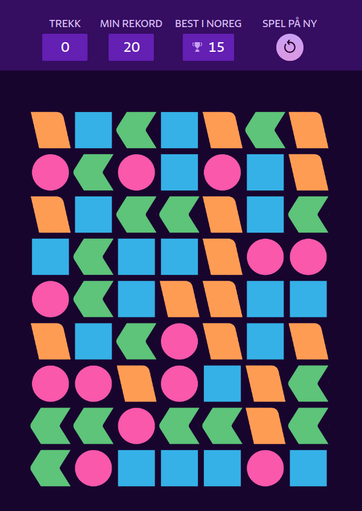

# Solving NRK's "Former" Puzzle Game Using Deep Q-Learning

This repository contains the code for solving [NRK's "Former"](https://www.nrk.no/former-1.17105310) puzzle game using Deep Q-Learning. The game is a 2D grid-based puzzle game where the goal is to remove all the blocks using as few moves as possible. The game is played on a 9x7 grid where each cell can contain a block of one of the four colors: pink, green, blue, and orange. 

**Figure 1:** Screenshot of the game from NRK's website.
