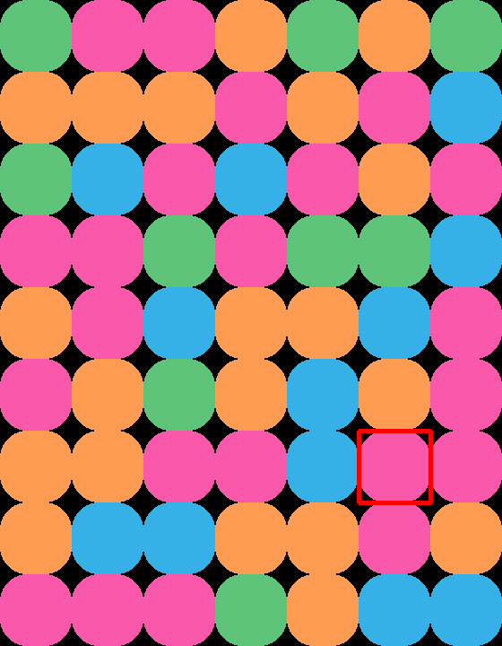

# Solving NRK's "Former" Puzzle Game Using Deep Q-Learning

This repository contains the code for solving [NRK's "Former"](https://www.nrk.no/former-1.17105310) puzzle game using Deep Q-Learning. The game is a 2D grid-based puzzle game where the goal is to remove all the blocks using as few moves as possible. The game is played on a 9x7 grid where each cell can contain a block of one of the four colors: pink, green, blue, and orange. 

**Figure 1:** Screenshot of the game from NRK's website.

## Playing the Game

To play the game using the environment, run `python environment.py`. The game is played using the arrow keys to move the cursor and the space bar to remove blocks. The game is won when all blocks are removed.

## Solving the Game Using Deep Q-Learning

Run `python inference.py` to let the agent solve the game using the trained model. The agent will play the game using the best action according to the trained Q-values. A screenshot of each step is saved in the `./policy_solution` directory.

## Training the Model

The agent is trained using Deep Q-Networks (DQN) with experience replay and target network. To train the model from scratch, delete the model checkpoint `main_network.pt` and run `python dqn.py`.
